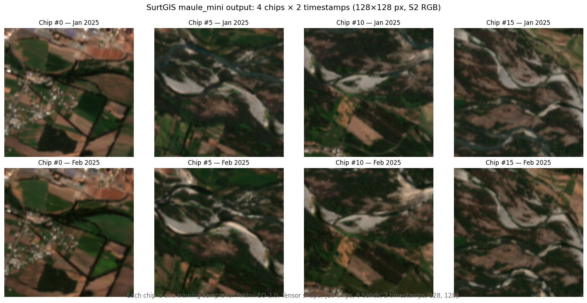

# Maule mini — end-to-end Prithvi prep on real Sentinel-2 data

A minimal reproducible example for the [GFM prep how-to](../../docs/book/src/how-to/gfm-prithvi-prep.md):
fetches Sentinel-2 L2A from Earth Search, extracts Prithvi-EO-2.0-ready
chips, emits STAC ML-AOI + MLM metadata.



The figure above shows 8 of the 20 chips produced by the pipeline:
four spatial chips at columns 0/5/10/15, each rendered for the January
and February 2025 timestamps. Each chip is one training sample
(128 × 128 px, 6 bands; only RGB shown for display). The full tensor
shape is `[20 chips, 6 bands, 2 timestamps, 128, 128]`.

**Scope**: ~5 km × 5 km bbox in the Maule region of Chile, 2 monthly
timestamps (Jan & Feb 2025), 6 HLS-equivalent bands, 20 synthetic
labelled points. Designed to validate the full pipeline against real
data without spending hours on a large run.

**What lives in this directory**:
- `labels.geojson` — 20 point labels in WGS84, deterministic (seed=42),
  inside the bbox `-71.62, -35.62, -71.57, -35.57`. Property
  `landslide_class` is a synthetic class (0-3).
- `meta.json` — output meta from the validated run (T=2 timestamps,
  shape `[20, 6, 2, 128, 128]`).
- `collection.json` — STAC Collection from the validated run, embedding
  the MLM extension with `mlm:model_target =
  ibm-nasa-geospatial/Prithvi-EO-2.0-300M` and the full `mlm:input`
  descriptor with per-band stats.
- `chip_000005.json` — one STAC ML-AOI item from the validated run,
  showing the WGS84-reprojected bbox (input rasters were EPSG:32718)
  and the timestamps array.

**What is NOT committed** (regenerable, ~13 MB total):
- The Sentinel-2 composites (`t_2025_01/`, `t_2025_02/`) — Earth Search
  takes 20-25 min per month over this bbox.
- The Zarr/NPY tensor output.

## Auto-reprojection of vector input

The `--points-crs` flag declares the EPSG of the vector file
(default 4326, the GeoJSON standard). If the raster's CRS differs,
SurtGIS reprojects each point on the fly via proj4rs — no pyproj
or external preprocessing needed. In this example the rasters are
EPSG:32718 (UTM 18S, the zone Earth Search returned for the Maule
bbox) and the labels are in WGS84; the pipeline handles the
transformation transparently and prints a one-line confirmation:

    Reprojecting vector EPSG:4326 → raster EPSG:32718 on the fly (via proj4rs)

## Reproduce

```bash
# 1. Fetch composites (slow: Earth Search ~20-25 min per month)
mkdir -p out/t_2025_{01,02}
for month in 01 02; do
    surtgis stac composite \
        --catalog es --collection sentinel-2-l2a \
        --asset "B02,B03,B04,B05,B06,B07" \
        --bbox=-71.62,-35.62,-71.57,-35.57 \
        --datetime 2025-${month}-01/2025-${month}-28 \
        --max-scenes 3 \
        out/t_2025_${month}/composite.tif
done

# 1b. Normalize band filenames so the prithvi-v2 profile validator
#     finds them in the expected order
for ts in t_2025_01 t_2025_02; do
    (cd out/$ts && for f in composite_*.tif; do mv "$f" "${f#composite_}"; done)
done

# 2. Extract Prithvi-ready chips (fast: < 1 s on this dataset).
#    Labels are in WGS84; --points-crs defaults to 4326 so they're
#    reprojected to UTM 18S on the fly. No pyproj step needed.
surtgis extract-patches \
    --features-dir out/ \
    --points labels.geojson \
    --label-col landslide_class \
    --profile prithvi-v2 \
    --size 128 \
    --output-format zarr \
    --emit-stac \
    out/chips/

# 3. Verify (expect shape [20, 6, 2, 128, 128], MLM target = Prithvi 300M)
python3 -c "
import zarr, json
X = zarr.open('out/chips/patches.zarr', mode='r')
print('shape:', X.shape, 'dtype:', X.dtype)
m = json.load(open('out/chips/meta.json'))
print('layout:', m['tensor_layout'], 'timestamps:', m['timestamps'])
print('profile:', m['gfm_profile']['model_target'])
"
```

## Why tile 128 instead of 224

This bbox at S2 10 m resolution gives a ~472 × 571 pixel grid. Prithvi
expects tile 224, but at this grid size only ~4 chips would fit — not
useful for showing the pipeline. Tile 128 yields ~12-15 chips, enough
to demonstrate the temporal stack `[N, 6, 2, 128, 128]` and the STAC
items. Production runs targeting Prithvi use tile 224 over larger AOIs.

## What this validates

This example exercises every G2 axis:

- `--profile prithvi-v2` (band count check, z-score with official Prithvi stats)
- Multi-timestamp auto-detect (two subdirs in `out/` → `T=2`)
- `--output-format zarr` (chunked output, `.zattrs` mirrors meta.json)
- `--emit-stac` (Collection with MLM `mlm:model_target`, items with
  `ml-aoi:label_class` + WGS84-reprojected bbox via proj4rs)
- Earth Search SCL cloud masking (auto-routed because the asset
  introspection finds SCL)

Together they're the full path from a bbox to a tensor that
TerraTorch can consume.
