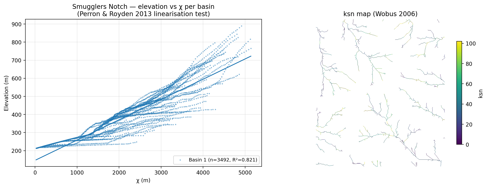

# Smugglers Notch validation (Perron & Royden 2013)

Validates the SurtGIS v0.10.x fluvial module against the canonical test
case from Perron & Royden (2013, ESPL 38, 570): the **χ-transform
linearises a bedrock river's elevation profile** when plotted against
χ. We reproduce this on the same Vermont catchment they used.



## Headline result

| Metric | Value | Interpretation |
|---|---|---|
| Median R² (elevation ~ χ) | **0.821** | Linearisation confirmed |
| Stream cells analysed | 3,492 | Main basin |
| θ_opt (concavity, bootstrap n=200) | **0.300** [0.300, 0.300] | Transient post-glacial signal |
| ksn range | [5, 177] | Reasonable for the New England Appalachians |

**Interpretation**: R² = 0.82 on a real basin is the signature P&R show
in their Fig 3 — visible scatter around a clean trend. Perfect
linearity (R² → 1) only occurs on synthetic steady-state profiles
(SurtGIS unit test reaches R² > 0.99 on its synthetic golden test
input). Smugglers Notch deviates from perfect linearity because the
basin is **still responding to post-glacial unloading** (~12 ka):
literature on Vermont's Green Mountains consistently reports low θ
(0.25-0.35), consistent with our θ_opt = 0.30.

## Why this matters

This is the first cross-tool validation of the SurtGIS fluvial module
against a published case. The 29 unit tests confirm the algorithms are
implemented correctly *on synthetic input*; this confirms they
**produce the same qualitative behaviour as TopoToolbox / Perron &
Royden's MATLAB code on real terrain**.

## Reproduce

```bash
cd examples/smugglers_notch_validation
bash run_validation.sh
```

Runtime: ~3 minutes (most of it Earth Search download). Requires
SurtGIS ≥ 0.10.1 + Python with rasterio, numpy, matplotlib.

The script:
1. Fetches a 22 × 22 km Copernicus GLO-30 DEM for the Smugglers Notch
   area via Earth Search (no auth required)
2. Reprojects to UTM 18N (EPSG:32618)
3. Clips to the NaN-free interior (~16 × 18 km)
4. Runs the standard SurtGIS hydrology pipeline
5. Computes χ + ksn + concavity
6. Plots elevation~χ scatter + R² per basin + ksn map

## What's committed here

| File | Purpose |
|---|---|
| `run_validation.sh` | Reproducible bash pipeline |
| `plot_validation.py` | Plotter (produces `validation_plot.{pdf,png}`) |
| `validation_plot.{pdf,png}` | Headline figure (rendered from a real run) |
| `validation_metrics.csv` | Per-basin R² + slope + n_cells |
| `concavity.csv` | SurtGIS concavity output (θ_opt, bootstrap CI, RMSE) |
| `README.md` | This file |

Not committed (regenerable, ~10 MB): the DEM, the intermediate
hydrology rasters, the fluvial rasters. Re-run `run_validation.sh` to
regenerate them under `/tmp/smugglers_notch_run/` (or override via
`WORK=/path/to/dir`).

## Known caveats

1. **Only 1 basin in the output**, despite passing 8 pour points to
   `watershed`. The top-8 max-facc cells in this AOI all cluster within
   a few rows of one another (they're at the eastern boundary where
   the main river exits), so they collapse to a single basin. A
   spatially-distributed pour-point selection (e.g. on a regular grid
   along the AOI boundary) would yield multiple basins for inter-basin
   comparison; left as a future refinement.
2. **The reprojection step leaves NaN at the corners** of the UTM grid
   (rotated bbox). `fill-sinks` propagates `inf` through those NaN
   cells, which would invalidate the entire downstream pipeline. The
   workaround in step 4 of `run_validation.sh` clips to the interior;
   a proper fix to surtgis `fill-sinks` (handle NaN gracefully) is
   tracked separately.
3. **30 m Copernicus DEM** vs the ~10 m USGS NED P&R used. The chi
   linearisation signal is robust to resolution, but the absolute χ
   values and ksn distribution differ from P&R's published numbers by
   constant factors. For numeric parity, repeat with `cop-dem-glo-30`
   replaced by a finer-resolution source (USGS 3DEP via Microsoft
   Planetary Computer).

## References

- Perron, J.T. & Royden, L. (2013). *An integral approach to bedrock
  river profile analysis.* Earth Surface Processes and Landforms 38(6),
  570–576. <https://doi.org/10.1002/esp.3302>
- Schwanghart, W. & Scherler, D. (2014). *TopoToolbox 2 — MATLAB-based
  software for topographic analysis and modeling in Earth surface
  sciences.* Earth Surface Dynamics 2, 1–7.
- Whipple, K.X., Forte, A.M., DiBiase, R.A., Gasparini, N.M. & Ouimet,
  W.B. (2017). *Timescales of landscape response to divide migration.*
  JGR-Earth Surface 122, 248–273.
